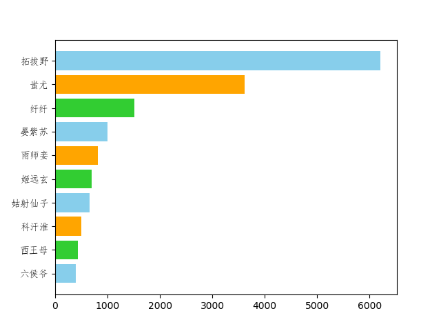
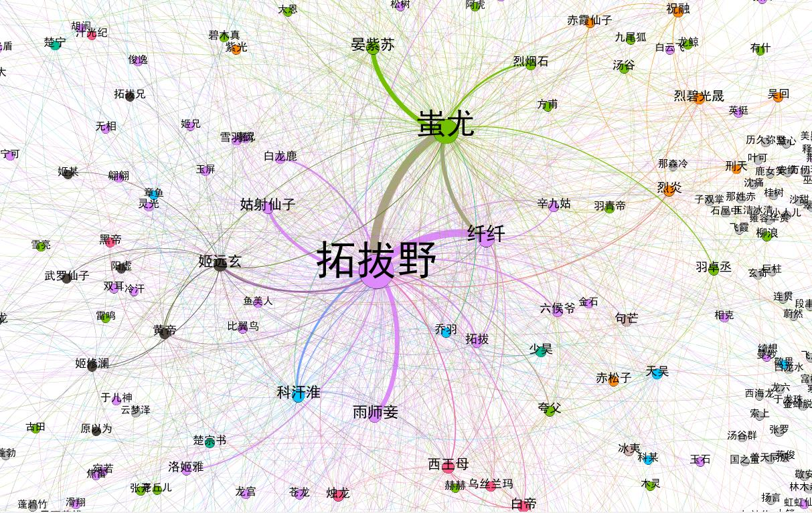

## Python版本 Show me the code.

- Image-to-Ascii: 
**图片转字符画**，来自[Python 图片转字符画](https://www.shiyanlou.com/courses/370/labs/1191/document)，使用numpy重写。
- soushen-analysis：
对小说《搜神记》进行了**文本分析**，来自[共现提取《釜山行》人物关系](https://www.shiyanlou.com/courses/677/labs/2202/document),jieba分词，统计主要人物出现频次，matplotlib画出柱状图；对每段进行人物共性分析，保存至csv，使用gephi绘图。

- 待续
